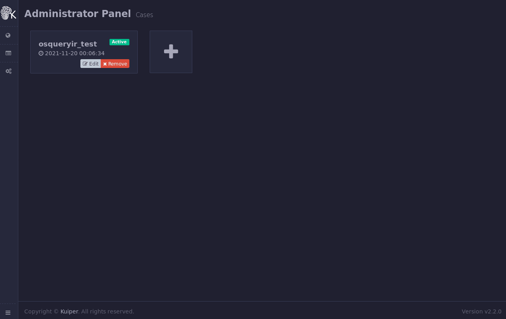

<p align="center">
  
</p>

<p align="center">
  
</p>

# Fennec 🦊

fennec is an artifact collection tool written in Rust to be used during incident response on *nix based systems. fennec allows you to write a configuration file that contains how to collect artifacts.

## Features 🌟

* 🦀 A single statically compiled binary 
* 🔬 Execute any osquery SQL query 
* 💻 Execute system commands 
* 📚 Parse any text file using regex 
* 🧰 Ability to collect system logs and files 
* 🧱 Return data in structured manner 
* 🃏  Support multiple output formats (JSONL, CSV and KJSON) 
* 🤸‍♀️ Flexible configuration file 
* 💾 Directly write to ZIP file to safe space 
* ⚡ Very fast!

## Tests 🧪

| OS Details         | Success? | Details                       |
| ------------------ | -------- | ----------------------------- |
| Ubuntu 20.04.3 LTS | ✅        |                               |
| Ubuntu 19.04       | ✅        |                               |
| Ubuntu 18.04.6 LTS | ✅        |                               |
| Ubuntu 17.04       | ✅        |                               |
| Ubuntu 16.04.7 LTS | ✅        |                               |
| Ubuntu 15.10       | ✅        |                               |
| Ubuntu 14.04.6 LTS | ✅        |                               |
| Ubuntu 13.04       | ✅        |                               |
| Ubuntu 12.04.5 LTS | ✅        |                               |
| CentOS 8.4.2105    | ✅        |                               |
| CentOS 7.9.2009    | ✅        |                               |
| CentOS 6.10        | ✅        |                               |
| CentOS 5.11        | ❌        | osquery requires libc >= 2.12 |

## Usage ✍

```verilog
fennec 0.1.0
AbdulRhman Alfaifi <aalfaifi@u0041.co>
Aritfact collection tool for *nix systems

USAGE:
    fennec_x86_64-unknown-linux-gnu [OPTIONS]

OPTIONS:
    -c, --config <FILE>             Sets a custom config file
    -f, --log-file <FILE>           Sets the log file name [default: fennec.log]
    -h, --help                      Print help information
    -l, --log-level <LEVEL>         Sets the log level [default: info] [possible values: trace,
                                    debug, info, error]
    -o, --output <FILE>             Sets output file name [default: ABDULRHMAN-PC.zip]
        --osquery-path <PATH>       Sets osquery path, if osquery is embedded it will be writen to
                                    this path otherwise the path will be used to spawn osquery
                                    instance [default: ./osqueryd]
        --output-format <FORMAT>    Sets output format [default: jsonl] [possible values: jsonl,
                                    csv, kjson]
    -q, --quiet                     Do not print logs to stdout
        --show-config               Show the embedded configuration file
    -V, --version                   Print version information
```

* `-c`, `--config` : Use the specified configuration file instead of the embedded configuration
* `-f`, `--log-file` : Change the default name for the log file (default: `fennec.log`)
* `-h`, `--help` : Print help message
* `-l`, `--log-level` : Change the default log level (default: `info`)
* `-o`, `--output` : Change the default output file name for the zip file (default: `{HOSTNAME}.zip`, where hostname is the runtime evaluated machine hostname) 
* `--osquery-path` : Path to osquery executable, This value will be used based on these conditions:
  * If osquery binary is embedded into `fennec` then extract it and dump it to `--osquery-path`
  * If osquery is not embedded into `fennec` then use the osquery binary in the path `--osquery-path`
* `--output-format` : Choose the output format, Supported formats:
  * jsonl : A new line separated JSON objects (default)
  * csv: Comma separated values
  * kjson: Use this format if you want to upload the resulting file to [Kuiper](https://github.com/DFIRKuiper/Kuiper) analysis platform.
* `-q`, `--quiet` : Do not print logs to `stdout`
* `--show-config` : Print the embedded configuration then exit
* `-V`, `--version` : Print `fennec` version then exit

## Compile with dependencies 👨‍💻

fennec depends on `osquery` to run the artifacts with the type `query`. The directory called `deps` contains the file that will be embedded into the binary, Before compiling follow the below steps:

* Modify the configuration file `deps/config.yaml` as needed

* Build the binary using one of the commands below:

  * dynamically linked: 

  ```bash
  cargo build --release
  ```

  * statically linked (compile all dependencies):

  ```bash
  RUSTFLAGS="-C target-feature=+crt-static" cargo build --release --target x86_64-unknown-linux-gnu
  ```

You can also use the precompiled binaries in the release section.

## Examples 🚀

### Default Configurations

The following is an example ran on `Ubuntu 20` with the same configurations in this repo:


### Using Fennec with Kuiper 

To output data to Kuiper supported format execute Fennec with the following argument:

```bash
sudo ./fennec --output-format kjson
```

or add the following to the `args` section in the configuration:

```yaml
args:
  - "--output-format"
  - "kjson"
```

recompile then execute:

```bash
sudo ./fennec
```

then upload the resulting zip file to Kuiper, the following is an example:



## Configuration🔨

By default the configuration in the path `deps/config.yaml` will be embedded into the executable during compilation. The configuration is in YAML format and have two sections:

### Args

contains a list of arguments to be passed to the executable as command line arguments, the following is an example for the `args` section that will set the output format to `jsonl` and the log file name to `fennec.log`:

```yaml
args:
- "--output-format"
- "jsonl"
- "--log-file"
- "fennec.log"
...
```

The command line arguments will be used in the following priorities:

* arguments passed to the executable
* arguments in the configuration file
* default arguments

### Artifacts

Contains a list of artifacts to be collected. Each artifact contains the following fields:

* name: the name of the artifact, the results of the artifact will be written to a file with this name
* type: the type of the artifact, the supported artifacts are:
  * query
  * collection
  * command
  * parse
* description (**optional**): contain description about the artifact
* quires **OR** paths **OR** commands: quires if the artifact type is **query** and it contains a list of osquery SQL queries. paths if the artifact type is collection **OR** parse and it contains a list of paths. commands if the artifact type is **command** and it contains a list commands. These names are for the sake of readability ,you can use any of them in any artifact type.
* regex: this field is only used if the artifact type **parse** is used, this field contains regex to parse text file
* maps (**optional**): contains a list of mappers to modify key names and format values, check the maps section for more details

#### Artifact Types: Query

Execute osquery SQL queries. The following example artifact to retrieve all users on the system:

```yaml
artifacts:
  - name: users
    type: query
    description: "List all local users"
    queries: 
      - 'select * from groups join user_groups using (gid) join users using (uid)'
...
```

#### Artifact Types: Collection

This artifact type collect files/folders specified in the field **paths**. The following is an example of this artifact type that collect system logs:

```yaml
artifacts:
  - name: logs
    type: collection
    description: "Collect system logs"
    paths:
      - '/var/log/**/*'
...
```

#### Artifact Types: Command

Execute system commands using the shell command interpreter in the following priority:

* **$SHELL** environment variable
* **/bin/bash**
* **/bin/sh**

This is an example of this artifact type that retrieve bad logins:

```yaml
artifacts:
  - name: bad_logins
    type: command
    description: "Get failed logins (/var/log/btmp)"
    commands:
        - 'lastb --time-format=iso'
```

#### Artifact Types: Parse

This artifact type provides the ability to parse text files using regex and return the data it in structured format. The example bellow parse nginx access logs and return the results in structured format:

```yaml
artifcats:
  - name: nginx_access
    type: parse
    description: "Nginx access logs"
    paths:
      - /var/log/nginx/access.*
    regex: '(?P<c_ip>[0-9]{1,3}\.[0-9]{1,3}\.[0-9]{1,3}\.[0-9]{1,3}) - (?P<remote_user>[^ ]+) \[(?P<time>[0-9]{2}/[a-zA-Z]{3}/[0-9]{4}:[0-9]{2}:[0-9]{2}:[0-9]{2} \+[0-9]{4})\] "(?P<method>[A-Z]+)?[ ]?(?P<uri>.*?)[ ]?(HTTP/(?P<http_prot>[0-9\.]+))?" (?P<status_code>[0-9]{3}) (?P<body_bytes_sent>[0-9]+) "(?P<referer>.*?)" "(?P<user_agent>.*?)"'
```

This configuration will read the files in the path `/var/log/nginx/access.*` line by line and run the regex to extract fields. This artifact also check if the file is in `gzip` format which is used to compress old logs to save space and decompresses them and parses them. The regex should be in **named captures** format as documented in the [rust regex library](https://docs.rs/regex/latest/regex/#grouping-and-flags). The following is an example nginx access record before and after parsing:

*  original record

  ```verilog
  192.168.133.70 - - [23/Jan/2022:19:14:37 +0000] "GET /blog/ HTTP/1.1" 200 2497 "https://u0041.co/" "Mozilla/5.0 (X11; Linux x86_64; rv:78.0) Gecko/20100101 Firefox/78.0"
  ```

* parsed record

  ```json
  {
    "c_ip": "192.168.133.70",
    "remote_user": "-",
    "time": "23/Jan/2022:19:14:37 +0000",
    "method": "GET",
    "uri": "/blog/",
    "http_prot": "1.1",
    "status_code": "200",
    "body_bytes_sent": "2497",
    "referer": "https://u0041.co/",
    "user_agent": "Mozilla/5.0 (X11; Linux x86_64; rv:78.0) Gecko/20100101 Firefox/78.0",
    "full_path": "/var/log/nginx/access.log.9.gz"
  }
  ```

### Maps

This optional field can be used to change result field names and run post processing called modifiers on the field value. The below example will show the results for parsing nginx access record without maps:

* artifact configurations:

```yaml
artifcats:
  - name: nginx_access
    type: parse
    description: "Nginx access logs"
    paths:
      - /var/log/nginx/access.*
    regex: '(?P<c_ip>[0-9]{1,3}\.[0-9]{1,3}\.[0-9]{1,3}\.[0-9]{1,3}) - (?P<remote_user>[^ ]+) \[(?P<time>[0-9]{2}/[a-zA-Z]{3}/[0-9]{4}:[0-9]{2}:[0-9]{2}:[0-9]{2} \+[0-9]{4})\] "(?P<method>[A-Z]+)?[ ]?(?P<uri>.*?)[ ]?(HTTP/(?P<http_prot>[0-9\.]+))?" (?P<status_code>[0-9]{3}) (?P<body_bytes_sent>[0-9]+) "(?P<referer>.*?)" "(?P<user_agent>.*?)"'
```

* original record

```verilog
192.168.133.70 - - [23/Jan/2022:19:14:37 +0000] "GET /blog/ HTTP/1.1" 200 2497 "https://u0041.co/" "Mozilla/5.0 (X11; Linux x86_64; rv:78.0) Gecko/20100101 Firefox/78.0"
```

* parsed record without maps

```json
{
  "c_ip": "192.168.133.70",
  "remote_user": "-",
  "time": "23/Jan/2022:19:14:37 +0000",
  "method": "GET",
  "uri": "/blog/",
  "http_prot": "1.1",
  "status_code": "200",
  "body_bytes_sent": "2497",
  "referer": "https://u0041.co/",
  "user_agent": "Mozilla/5.0 (X11; Linux x86_64; rv:78.0) Gecko/20100101 Firefox/78.0",
  "full_path": "/var/log/nginx/access.log.9.gz"
}
```

To change the field name `time` to `@timestamp` we add the following maps configuration to the artifact configurations:

```yaml
artifcats:
  - name: nginx_access
    type: parse
    description: "Nginx access logs"
    paths:
      - /var/log/nginx/access.*
    regex: '(?P<c_ip>[0-9]{1,3}\.[0-9]{1,3}\.[0-9]{1,3}\.[0-9]{1,3}) - (?P<remote_user>[^ ]+) \[(?P<time>[0-9]{2}/[a-zA-Z]{3}/[0-9]{4}:[0-9]{2}:[0-9]{2}:[0-9]{2} \+[0-9]{4})\] "(?P<method>[A-Z]+)?[ ]?(?P<uri>.*?)[ ]?(HTTP/(?P<http_prot>[0-9\.]+))?" (?P<status_code>[0-9]{3}) (?P<body_bytes_sent>[0-9]+) "(?P<referer>.*?)" "(?P<user_agent>.*?)"'
    maps:
    - from: time		#change field name from
      to: '@timestamp'	# to this name
```

After running the collection tool with the configuration on the same nginx access log we get the following output:

```json
{
  "c_ip": "192.168.133.70",
  "remote_user": "-",
  "@timestamp": "23/Jan/2022:19:14:37 +0000",
  "method": "GET",
  "uri": "/blog/",
  "http_prot": "1.1",
  "status_code": "200",
  "body_bytes_sent": "2497",
  "referer": "https://u0041.co/",
  "user_agent": "Mozilla/5.0 (X11; Linux x86_64; rv:78.0) Gecko/20100101 Firefox/78.0",
  "full_path": "/var/log/nginx/access.log.9.gz"
}
```

#### Modifiers

modifiers provides post processing on field value of the artifact results. For example reformatting date and time. Continuing on the example above we can change the date and time format in the field `@timestamp` to the format `%Y-%m-%d %H:%M:%S`. We can add the following to the artifact configurations to accomplish that:

```yaml
artifacts:
  - name: nginx_access
    type: parse
    description: "Nginx access logs"
    paths:
      - /var/log/nginx/access.*
    regex: '(?P<c_ip>[0-9]{1,3}\.[0-9]{1,3}\.[0-9]{1,3}\.[0-9]{1,3}) - (?P<remote_user>[^ ]+) \[(?P<time>[0-9]{2}/[a-zA-Z]{3}/[0-9]{4}:[0-9]{2}:[0-9]{2}:[0-9]{2} \+[0-9]{4})\] "(?P<method>[A-Z]+)?[ ]?(?P<uri>.*?)[ ]?(HTTP/(?P<http_prot>[0-9\.]+))?" (?P<status_code>[0-9]{3}) (?P<body_bytes_sent>[0-9]+) "(?P<referer>.*?)" "(?P<user_agent>.*?)"'
    maps:
    - from: time
      to: "@timestamp"
      modifier: 
        name: datetime_to_iso
        parameters:
          input_time_format: '%d/%b/%Y:%H:%M:%S %z'
          output_time_format: '%Y-%m-%d %H:%M:%S'
```

The resulting record will look like this:

```json
{
  "c_ip": "192.168.133.70",
  "remote_user": "-",
  "@timestamp": "2022-01-23 19:14:37",
  "method": "GET",
  "uri": "/blog/",
  "http_prot": "1.1",
  "status_code": "200",
  "body_bytes_sent": "2497",
  "referer": "https://u0041.co/",
  "user_agent": "Mozilla/5.0 (X11; Linux x86_64; rv:78.0) Gecko/20100101 Firefox/78.0",
  "full_path": "/var/log/nginx/access.log.9.gz"
}
```

The available modifiers are:

| Name                     | Details                                                      | input_time_format                      | output_time_format                                           |
| ------------------------ | ------------------------------------------------------------ | -------------------------------------- | ------------------------------------------------------------ |
| epoch_to_iso             | Converts epoch timestamp to custom date and time format      | N/A                                    | specify the output date and time format , default is `%Y-%m-%d %H:%M:%S` |
| datetime_to_iso          | Reformat date and time form the format `input_time_format` to the format `output_time_format` | specify the input date and time format | specify the output date and time format , default is `%Y-%m-%d %H:%M:%S` |
| time_without_year_to_iso | Format date and time without a year data form the format `input_time_format` to the format `output_time_format` | specify the input date and time format | specify the output date and time format , default is `%Y-%m-%d %H:%M:%S` |

The `time_without_year_to_iso` modifier works as follows:

* Add current year then check if parser time < current time, if it is then it is the correct time
* otherwise it is the previous year

This modifier assumes the logs are for **ONLY** one year, use this modifier with caution
